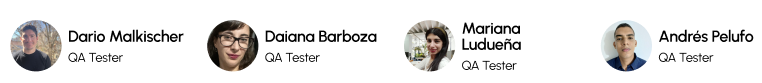

# AURA – Sistema de Gestión Clínica Integral

**AURA** es una solución web integral pensada para centros terapéuticos que buscan digitalizar y optimizar la gestión de pacientes, turnos y documentación clínica. El objetivo es brindar una herramienta centralizada, segura y eficiente que facilite el trabajo tanto del personal administrativo como del equipo profesional.

---

## 🚀 Nuestra solución

**AURA** permite cargar, actualizar y consultar información clínica y administrativa desde una plataforma accesible, simple e intuitiva. Las funcionalidades están diseñadas para optimizar la operatividad diaria y mejorar la experiencia de gestión de turnos y pacientes.

### Funcionalidades principales

- 📅 **Agenda y gestión de turnos**: Permite organizar, registrar y reprogramar citas fácilmente.
- 📋 **Historia clínica digital compartida**: Información centralizada accesible por profesionales autorizados.
- 🧾 **Carga de antecedentes y estudios**: Adjuntos e historial accesible en cada perfil de paciente.
- 🔒 **Seguridad y accesibilidad**: Acceso controlado por roles y manejo eficiente de datos sensibles.

---

## 🎯 Objetivos y metas

- **Centralización de la información clínica** para evitar pérdidas y duplicaciones.
- **Organización y seguimiento** eficiente de turnos, pacientes y documentación.
- **Digitalización del historial médico**, facilitando el trabajo interdisciplinario.
- **Accesibilidad web multiplataforma** para todos los perfiles del centro.

---

## 🖼️ Screenshots
- 
- 
- 
- 

---

## 👥 Nuestro equipo: **BugBusters**

- 

---

### UX/UI
- 

**Tareas:**

- Investigación UX: entrevistas, encuestas, benchmark.
- Arquitectura de información, User Flow, Taskflow.
- Wireframes de alta fidelidad y prototipado.
- Diseño UI, mockups e interacción.

**Herramientas:** Figma, Google Drive, Miro, Cloudinary  
**Prototipo:** [Enlace al prototipo]

---

### Backend

- 

**Tareas:**

- Desarrollo de API con Java - Spring Boot.
- Base de datos en PostgreSQL.
- Validación de usuarios con JWT.
- Envío de notificaciones por email (Spring Mail).
- Documentación con Swagger.
- Deploy en Azure.

**Herramientas:** Java, Spring Boot, PostgreSQL, Swagger, Azure

---

### Frontend

- 

**Tareas:**

- Desarrollo de componentes en Angular.
- Implementación de rutas y servicios.
- Consumo de imágenes desde Cloudinary.
- Responsive design con Bootstrap.
- Deploy en AWS.

**Herramientas:** Angular, Bootstrap, NgRx, AWS

---

### QA & Testing

- 

**Tareas:**

- Definición del producto mínimo viable (MVP).
- Desarrollo de reglas de negocio, historias de usuario y criterios de aceptación.
- Creación de casos de uso y flujos alternos.
- Testing funcional y exploratorio.
- Ejecución y documentación de pruebas (test plan, incidencias).
- Testing de la API con Postman.

**Herramientas:** Jira, Google Docs, Postman

---

## 📄 Documentación

- [Documento de Requerimientos del Producto (PRD)](https://docs.google.com/document/d/1YFGfyz-5oPJKcNYgA68cQXGOBn9bpH7P/edit#heading=h.j44bz483i10e)
- [Prototipo UX/UI](#)
- [Documentación Técnica – API Swagger](#)
- [Plan de Pruebas](#)

---

## 📬 Contacto

Si deseas saber más del proyecto o del equipo, no dudes en escribirnos o visitar nuestros perfiles de LinkedIn y GitHub.

---

